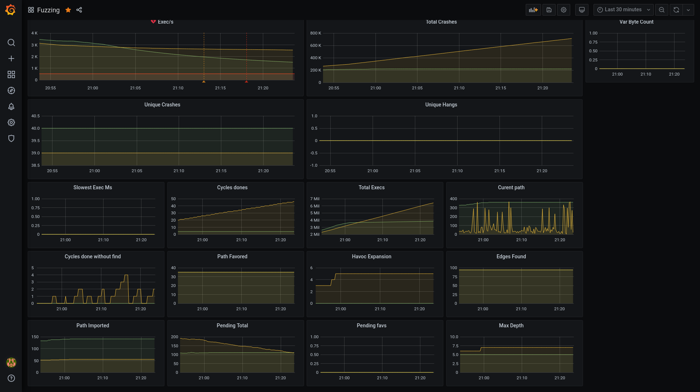

# Remote monitoring with StatsD

StatsD allows you to receive and aggregate metrics from a wide range of applications and retransmit them to the backend of your choice.
This enables you to create nice and readable dashboards containing all the information you need on your fuzzer instances.
No need to write your own statistics parsing system, deploy and maintain it to all your instances, sync with your graph rendering system...

The available metrics are :
- cycle_done
- cycles_wo_finds
- execs_done
- execs_per_sec
- paths_total
- paths_favored
- paths_found
- paths_imported
- max_depth
- cur_path
- pending_favs
- pending_total
- variable_paths
- unique_crashes
- unique_hangs
- total_crashes
- slowest_exec_ms
- edges_found
- var_byte_count
- havoc_expansion

Compared to the default integrated UI, these metrics give you the opportunity to visualize trends and fuzzing state over time.
By doing so, you might be able to see when the fuzzing process has reached a state of no progress, visualize what are the "best strategies"
(according to your own criteria) for your targets, etc. And doing so without requiring to log into each instance manually.

An example visualisation may look like the following:


*Notes: The exact same dashboard can be imported with [this JSON template](statsd/grafana-afl++.json).*

## How to use

To enable the StatsD reporting on your fuzzer instances, you need to set the environment variable `AFL_STATSD=1`.

Setting `AFL_STATSD_TAGS_FLAVOR` to the provider of your choice will assign tags / labels to each metric based on their format.
The possible values are  `dogstatsd`, `librato`, `signalfx` or `influxdb`.
For more information on these env vars, check out `docs/env_variables.md`.

The simplest way of using this feature is to use any metric provider and change the host/port of your StatsD daemon,
with `AFL_STATSD_HOST` and `AFL_STATSD_PORT`, if required (defaults are `localhost` and port `8125`).
To get started, here are some instructions with free and open source tools.
The following setup is based on Prometheus, statsd_exporter and Grafana.
Grafana here is not mandatory, but gives you some nice graphs and features.

Depending on your setup and infrastructure, you may want to run these applications not on your fuzzer instances.
Only one instance of these 3 application is required for all your fuzzers.

To simplify everything, we will use Docker and docker-compose.
Make sure you have them both installed. On most common Linux distributions, it's as simple as:

```sh
curl -fsSL https://get.docker.com -o get-docker.sh
sh get-docker.sh
```

Once that's done, we can create the infrastructure.
Create and move into the directory of your choice. This will store all the configurations files required.

First, create a `docker-compose.yml` containing the following:
```yml
version: '3'

networks:
  statsd-net:
    driver: bridge

services:
  prometheus:
    image: prom/prometheus
    container_name: prometheus
    volumes:
      - ./prometheus.yml:/prometheus.yml
    command:
      - '--config.file=/prometheus.yml'
    restart: unless-stopped
    ports:
      - "9090:9090"
    networks:
      - statsd-net

  statsd_exporter:
    image: prom/statsd-exporter
    container_name: statsd_exporter
    volumes:
      - ./statsd_mapping.yml:/statsd_mapping.yml
    command:
      - "--statsd.mapping-config=/statsd_mapping.yml"
    ports:
      - "9102:9102/tcp"
      - "8125:9125/udp"
    networks:
      - statsd-net
  
  grafana:
    image: grafana/grafana
    container_name: grafana
    restart: unless-stopped
    ports:
        - "3000:3000"
    networks:
      - statsd-net
```

Then `prometheus.yml`
```yml
global:
  scrape_interval:      15s
  evaluation_interval:  15s

scrape_configs:
  - job_name: 'fuzzing_metrics'
    static_configs:
      - targets: ['statsd_exporter:9102']
```

And finally `statsd_mapping.yml`
```yml 
mappings:
- match: "fuzzing.*"
  name: "fuzzing"
  labels:
      type: "$1"
```

Run `docker-compose up -d`.

Everything should now be setup, you are now able to run your fuzzers with

```
AFL_STATSD_TAGS_FLAVOR=dogstatsd AFL_STATSD=1 afl-fuzz -M test-fuzzer-1 -i i -o o ./bin/my-application @@
AFL_STATSD_TAGS_FLAVOR=dogstatsd AFL_STATSD=1 afl-fuzz -S test-fuzzer-2 -i i -o o ./bin/my-application @@
...
```

This setup may be modified before use in a production environment. Depending on your needs: adding passwords, creating volumes for storage,
tweaking the metrics gathering to get host metrics (CPU, RAM ...).
